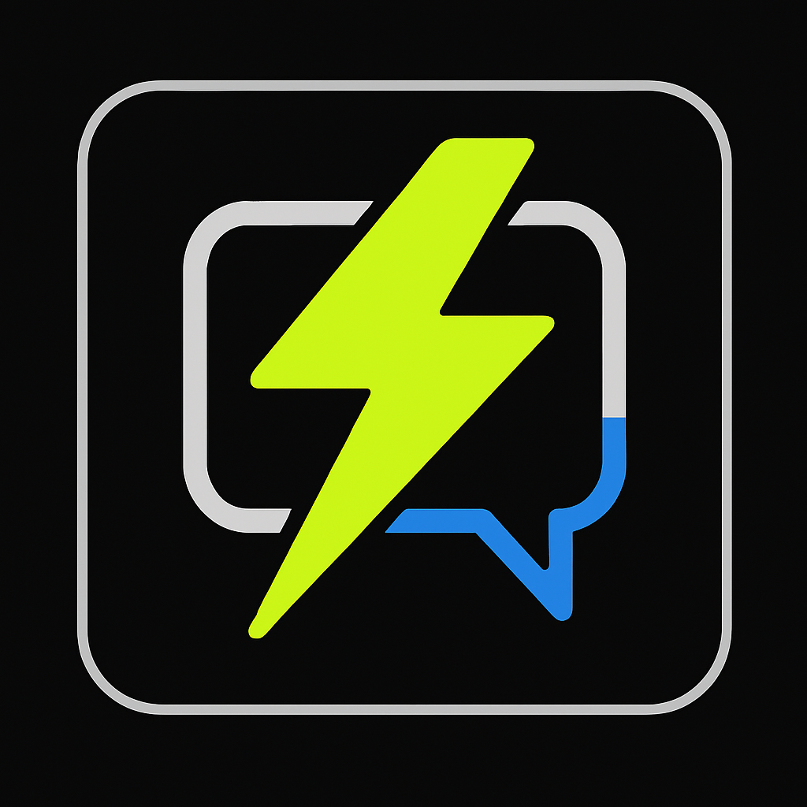

# Quick and Easy Tech Communication Hub - Demo Application

[](https://opensource.org/licenses/MIT)
[](https://your-demo-url.com)

A demonstration application showcasing the key features and user interface of the **Quick and Easy Tech Communication Hub**. This demo provides an interactive preview of how the Communication Hub unifies multiple messaging platforms into a single, intelligent interface powered by AI.



## 🚀 Features Demonstrated

### Core Messaging Features
- **Unified Inbox**: View and respond to messages from WhatsApp, Telegram, Slack, Discord, and Microsoft Teams in one place
- **Platform-Aware Messaging**: Visual indicators showing which platform each message belongs to
- **Real-Time Messaging**: Interactive message sending and receiving simulation
- **Cross-Platform Search**: Search across all messaging platforms simultaneously

### 🤖 AI-Powered Intelligence
- **Sentiment Analysis**: Visual indicator showing the emotional tone of conversations
- **Smart Replies**: Context-aware response suggestions that can be selected with one click
- **Conversation Context**: Maintains conversation history across platforms
- **Intelligent Notifications**: Priority-based message filtering

### 📊 Productivity Tools
- **Analytics Dashboard**: Visual representation of message volume by platform
- **Task Management**: Convert messages to tasks and track completion
- **Workflow Actions**: Quick access to common actions like scheduling meetings and creating documents
- **Contact Management**: Centralized contact details and interaction history

### 🎨 Professional Branding
- **Quick and Easy Tech Branding**: Consistent application of brand colors (Black, Lime Green #A6FF00, Electric Blue)
- **Modern Interface**: Clean, intuitive design that enhances productivity
- **Responsive Layout**: Adapts to different screen sizes for optimal viewing
- **PWA Support**: Install as a Progressive Web App on mobile and desktop

## 🎯 Live Demo

Experience the Communication Hub in action: [**Launch Demo**](https://your-demo-url.com)

## 📦 Installation

### Option 1: Direct Download
1. Download the latest release from the [Releases](https://github.com/yourusername/communication-hub-demo/releases) page
2. Extract the files to your web server directory
3. Open `index.html` in your browser

### Option 2: Clone Repository
```bash
git clone https://github.com/yourusername/communication-hub-demo.git
cd communication-hub-demo
```

### Option 3: Serve Locally
```bash
# Using Python
python3 -m http.server 8000

# Using Node.js
npx serve

# Using PHP
php -S localhost:8000
```

Then open your browser to `http://localhost:8000`

## 🎮 How to Use the Demo

1. **Platform Navigation**: Click on different platforms in the left sidebar to filter conversations
2. **Conversation Selection**: Click on a conversation in the chat list to view the message thread
3. **Sending Messages**: Type in the message input field and click the send button (or press Enter)
4. **Smart Replies**: Click on any suggested smart reply to automatically fill the message input
5. **Workflow Actions**: Click on workflow buttons in the right sidebar to simulate actions
6. **Task Management**: Check/uncheck tasks to mark them as complete
7. **Analytics**: View message distribution across platforms in the sidebar chart

## 🛠️ Technical Implementation

This demo is built using modern web technologies:

- **HTML5**: Semantic markup and accessibility features
- **CSS3**: Modern styling with flexbox/grid layouts and animations
- **JavaScript**: Interactive functionality and DOM manipulation
- **Chart.js**: Analytics visualization
- **Font Awesome**: Professional iconography
- **Google Fonts**: Typography (Montserrat, Open Sans)
- **PWA**: Progressive Web App capabilities with manifest and service worker support

## 📁 Project Structure

```
communication-hub-demo/
├── index.html              # Main application HTML
├── styles.css              # Application styles
├── script.js               # Application logic
├── manifest.json           # PWA manifest
├── README.md              # This file
└── assets/
    ├── logo.png           # Quick and Easy Tech logo
    ├── favicon.png        # Browser favicon
    ├── app_icon_192.png   # PWA icon (192x192)
    ├── app_icon_512.png   # PWA icon (512x512)
    └── square_icon.png    # Application icon
```

## 🌟 Key Highlights

- **Zero Dependencies**: Runs entirely in the browser with no build process required
- **Lightweight**: Fast loading and responsive performance
- **Cross-Browser**: Compatible with all modern browsers
- **Mobile-Friendly**: Fully responsive design that works on all devices
- **Offline-Ready**: PWA capabilities allow offline access (when installed)

## 🔒 Security & Privacy

This is a demonstration application with simulated functionality. No actual messages are sent or stored. In a production environment, the Communication Hub implements:

- End-to-end encryption for all messages
- Secure API connections to messaging platforms
- Data privacy compliance (GDPR, CCPA)
- Role-based access control
- Audit logging

## 🚧 Limitations

This demo simulates the Communication Hub experience with:
- Pre-populated sample conversations
- Simulated message sending (no actual API connections)
- Static analytics data
- Mock workflow actions

For the full production version with real integrations, please contact Quick and Easy Tech.

## 📝 License

This project is licensed under the MIT License - see the [LICENSE](LICENSE) file for details.

## 🤝 Contributing

We welcome contributions! Please feel free to submit a Pull Request. For major changes, please open an issue first to discuss what you would like to change.

## 📞 Contact & Support

- **Website**: [https://quickandeasytech.com](https://quickandeasytech.com)
- **Email**: info@quickandeasytech.com
- **Issues**: [GitHub Issues](https://github.com/yourusername/communication-hub-demo/issues)

## 🎓 About Quick and Easy Tech

Quick and Easy Tech specializes in creating innovative communication and productivity solutions for businesses. Our Communication Hub is designed to streamline team collaboration by unifying multiple messaging platforms with AI-powered intelligence.

## 🙏 Acknowledgments

- Font Awesome for the comprehensive icon library
- Chart.js for beautiful data visualizations
- Google Fonts for professional typography
- The open-source community for inspiration and tools

---

**© 2025 Quick and Easy Tech. All rights reserved.**

Made with ⚡ by Quick and Easy Tech

